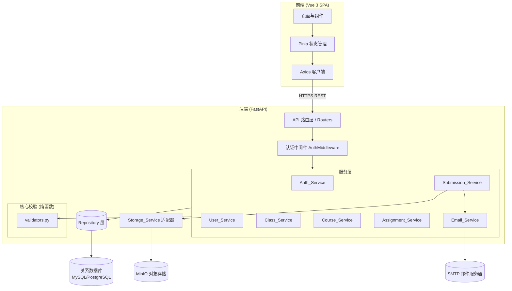
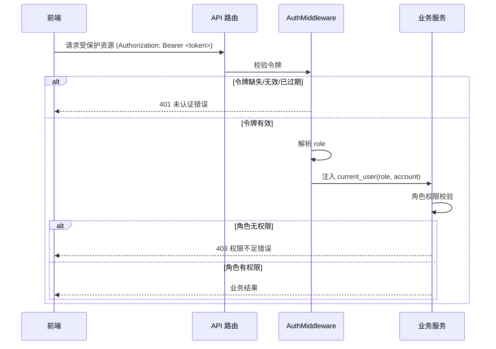
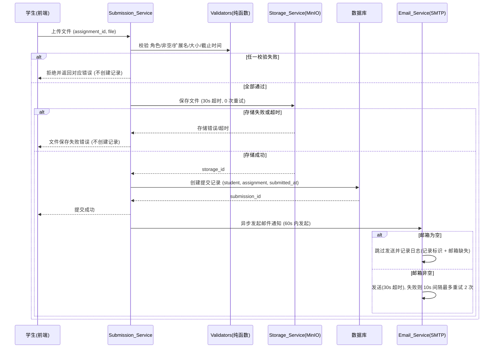

# 设计文档

## Overview

本系统是一个采用前后端分离架构的作业文件上传系统。后端基于 **Python + FastAPI** 提供 REST API，前端基于 **Vue 3** 构建单页应用（SPA）。系统围绕三种角色（Admin、Teacher、Student）展开，覆盖用户认证、用户管理、班级管理、课程管理、作业管理、作业提交、文件存储与邮件通知等业务。

技术选型说明（greenfield，无既有代码约束）：

| 关注点 | 选型 | 理由 |
| --- | --- | --- |
| 后端框架 | FastAPI | 原生异步、Pydantic 校验、OpenAPI 自动文档，适合 I/O 密集（文件上传、对象存储、邮件） |
| 数据持久化 | SQLAlchemy 2.x ORM + MySQL/PostgreSQL | 业务实体关系清晰，事务支持强 |
| 数据校验 | Pydantic v2 | 与 FastAPI 深度集成，便于把校验逻辑抽离为纯函数 |
| 会话令牌 | JWT（含 role 与 exp 声明） | 无状态、自带过期时间，契合“30 分钟有效期” |
| 对象存储 | MinIO（minio Python SDK） | 需求明确要求 MinIO |
| 邮件发送 | aiosmtplib | 异步发送、便于实现超时与重试控制 |
| 异步任务 | FastAPI BackgroundTasks / asyncio | 邮件“提交后 60 秒内发起”与重试逻辑 |
| 属性测试 | Hypothesis | Python 生态的成熟 PBT 库 |
| 前端 | Vue 3 + Pinia + Axios + Element Plus | SPA、状态管理、表单与下拉选择控件丰富 |

设计目标：

- 将**业务校验规则**（邮箱格式、字段长度、文件扩展名、文件大小、截止时间、批量处理、重试次数等）抽离为**纯函数**，使其可被属性测试覆盖。
- 将**外部副作用**（MinIO、SMTP、数据库）通过接口抽象，便于 mock 与超时/重试控制。
- 严格遵循 requirements.md 的全部验收标准。

## Architecture

### 系统总体架构



### 请求认证流程



### 作业提交关键流程



### 分层职责

- **API 路由层**：解析 HTTP 请求/响应、绑定 Pydantic 模型、统一错误码映射。
- **认证中间件**：解析并校验 JWT，注入 `current_user`，对无效令牌返回 401。
- **服务层**：业务编排，调用校验纯函数与 Repository，处理角色授权。
- **核心校验层（纯函数）**：无副作用的校验与计算逻辑，是属性测试的主要对象。
- **Repository 层**：封装数据库访问（唯一性检查、关联查询、事务）。
- **适配器层**：`Storage_Service`（MinIO）与 `Email_Service`（SMTP）封装外部副作用，定义接口以便 mock。

## Components and Interfaces

下列接口以 Python 类型签名描述服务层与核心校验层。校验纯函数返回 `ValidationResult`，服务层据此映射为 HTTP 错误码。错误统一通过 `ErrorCode` 枚举表达（详见 Error Handling）。

### 核心校验（纯函数，validators.py）

```python
from dataclasses import dataclass
from datetime import datetime
from typing import Optional

@dataclass(frozen=True)
class ValidationResult:
    ok: bool
    error_code: Optional["ErrorCode"] = None  # ok=False 时非空

ALLOWED_EXTENSIONS: frozenset[str] = frozenset({"md", "pdf", "docx", "zip", "rar", "7z"})
MIN_FILE_SIZE_MB: int = 1
MAX_FILE_SIZE_MB: int = 100
DEFAULT_FILE_SIZE_MB: int = 5
DEFAULT_PASSWORD: str = "minglog666"
SESSION_TTL_MINUTES: int = 30

def validate_email(email: str) -> ValidationResult:
    """本地名@域名：恰好一个 @，本地名非空，域名非空且含至少一个点号。"""

def validate_role(role: str) -> ValidationResult:
    """role ∈ {Admin, Teacher, Student}。"""

def validate_required(value: Optional[str]) -> bool:
    """非空且非纯空白。"""

def validate_length(value: str, max_len: int) -> bool:
    """字符长度 <= max_len。"""

def validate_extension(filename: str, allowed: frozenset[str]) -> ValidationResult:
    """提取扩展名并不区分大小写比对 allowed。"""

def validate_file_size(size_bytes: int, max_mb: int) -> ValidationResult:
    """size_bytes <= max_mb * 1024 * 1024，且 size_bytes > 0。"""

def validate_max_file_size_setting(max_mb: Optional[float]) -> ValidationResult:
    """None -> 视为默认 5；否则必须是 1..100 (含) 的正数（整数）。"""

def normalize_max_file_size(max_mb: Optional[float]) -> int:
    """None -> DEFAULT_FILE_SIZE_MB；否则原值。"""

def validate_deadline(deadline: datetime, now: datetime) -> ValidationResult:
    """deadline 必须晚于 now。"""

def validate_allowed_extension_set(exts: frozenset[str]) -> ValidationResult:
    """非空且为 ALLOWED_EXTENSIONS 的子集。"""

def compute_token_expiry(issued_at: datetime) -> datetime:
    """issued_at + 30 分钟。"""

def is_token_valid(expiry: datetime, now: datetime) -> bool:
    """now < expiry。"""
```

### Auth_Service

```python
class AuthService:
    def login(self, account: str, password: str, now: datetime) -> LoginResult:
        """
        校验账号/密码非空 -> 查找用户 -> 校验存储密码非空 ->
        校验凭据匹配 -> 签发含 role 与 exp(=now+30min) 的令牌。
        失败返回对应 ErrorCode（必填缺失/账号或密码错误/需要重置密码）。
        """

    def verify_token(self, token: Optional[str], now: datetime) -> TokenResult:
        """令牌缺失/无效/过期 -> UNAUTHENTICATED；有效 -> 返回 (role, account)。"""
```

### User_Service

```python
class UserService:
    def create_user(self, cmd: CreateUserCommand) -> CreateUserResult:
        """校验必填(role, account)/role 取值/邮箱格式/账号唯一；password 可为空。"""

    def batch_create_users(self, records: list[UserRecord]) -> BatchResult:
        """
        记录数为空 -> 拒绝(记录为空错误)；记录数 > 1000 -> 整体拒绝(超上限错误)。
        否则逐条处理：有效记录创建；账号重复/邮箱格式错误 -> 跳过并记入失败列表。
        返回 success_count, failure_count, failures[(row_id, reason)]。
        """

    def create_teacher(self, current_role: str, account: str, email: str) -> CreateTeacherResult:
        """非 Admin -> 权限不足；account/email 任一为空 -> 必填缺失；否则创建 Teacher 并返回 account。"""

    def create_student(self, current_role: str, class_id: str, rec: StudentRecord) -> CreateStudentResult:
        """非 Teacher -> 权限不足；student_id/name/email 任一为空 -> 必填缺失；
        student_id 已存在 -> 学号重复；password 缺省 -> DEFAULT_PASSWORD；成功关联到 class_id。"""

    def batch_import_students(self, current_role: str, class_id: str,
                              records: list[StudentRecord]) -> BatchResult:
        """逐条校验（学号/姓名/邮箱非空、邮箱合法、学号系统内不存在且批次内未重复）；
        无效/重复记录跳过并记入失败列表；返回 success/failure 计数与失败明细。"""
```

### Class_Service

```python
class ClassService:
    def create_class(self, current_role: str, school: str, grade: str, major: str) -> CreateClassResult:
        """非 Teacher -> 权限不足；school/grade/major 任一空白 -> 必填缺失；
        任一长度 > 20 -> 对应字段超长错误；通过 -> 创建并返回 class_id。"""
```

### Course_Service

```python
class CourseService:
    def list_classes(self) -> list[ClassSummary]:
        """供前端下拉选择的已存在班级列表。"""

    def create_course(self, current_role: str, semester: str, name: str,
                      class_id: str) -> CreateCourseResult:
        """非 Teacher -> 权限不足；semester/name/class_id 任一空白 -> 必填缺失；
        name 长度 > 20 -> 课程名称超长；class_id 不存在 -> 班级不存在；通过 -> 创建并返回 course_id。"""
```

### Assignment_Service

```python
class AssignmentService:
    def list_courses(self) -> list[CourseSummary]:
        """供前端下拉选择的已存在课程列表。"""

    def create_assignment(self, current_role: str, cmd: CreateAssignmentCommand,
                          now: datetime) -> CreateAssignmentResult:
        """非 Teacher -> 权限不足；title/course_id/deadline 任一空 -> 必填缺失；
        title 长度 > 20 -> 标题超长；content 长度 > 100 -> 说明超长；
        allowed_extensions 为空 -> 至少选一种；非 ALLOWED_EXTENSIONS 子集 -> 取值无效；
        max_file_size 缺省 -> 5MB，超出 1..100 -> 取值无效；
        course_id 不存在 -> 课程不存在；deadline <= now -> 截止时间无效；通过 -> 创建并返回 assignment_id。"""
```

### Submission_Service

```python
class SubmissionService:
    def submit(self, current_role: str, student_account: str, assignment_id: str,
               file: UploadedFile, now: datetime) -> SubmitResult:
        """
        非 Student -> 权限不足；assignment 不存在 -> 作业不存在；
        文件缺失或 0 字节 -> 文件为空；扩展名不在允许集合(忽略大小写) -> 扩展名不被允许；
        大小超过 max_file_size -> 文件超过大小限制；now > deadline -> 已超过截止时间；
        全部通过 -> 调用 Storage_Service 保存(30s 超时, 0 重试)；
        存储失败/超时 -> 文件保存失败(不创建记录)；
        存储成功 -> 创建提交记录(student, assignment, submitted_at, file_name, storage_id)；
        创建成功 -> 触发 Email_Service 异步通知。
        """
```

### Storage_Service（MinIO 适配器接口）

```python
class StorageService(Protocol):
    def save(self, object_name: str, data: bytes, timeout_seconds: int = 30) -> StorageResult:
        """成功返回唯一 storage_id；30s 内未完成 -> 超时错误；其他错误 -> 存储错误。
        Submission_Service 对该调用执行 0 次重试。"""
```

### Email_Service（SMTP 适配器接口）

```python
class EmailService:
    async def notify_submission(self, submission: SubmissionRecord,
                                student_email: Optional[str]) -> None:
        """
        邮箱为空 -> 跳过发送并记录日志(submission_id + 邮箱缺失)。
        邮箱非空 -> 在提交成功后 60s 内发起；单次发送 30s 超时判失败；
        失败以 10s 间隔最多重试 2 次(累计 ≤ 3 次)；全部失败 -> 记录失败日志并保持提交记录有效。
        邮件正文含：作业标题、精确到秒的提交时间、提交文件名。
        """

    def build_email_body(self, assignment_title: str, submitted_at: datetime,
                         file_name: str) -> str:
        """构造邮件正文（纯函数，便于断言内容）。"""

def next_attempt_schedule(max_retries: int = 2, interval_seconds: int = 10) -> list[int]:
    """返回每次重试相对首次失败的延迟秒数列表，长度 = max_retries。"""
```

## Data Models

### 实体关系图

```mermaid
erDiagram
    USER ||--o{ CLASS : "teacher 创建"
    CLASS ||--o{ USER : "包含 student"
    CLASS ||--o{ COURSE : "关联"
    COURSE ||--o{ ASSIGNMENT : "包含"
    ASSIGNMENT ||--o{ SUBMISSION : "收到"
    USER ||--o{ SUBMISSION : "student 提交"

    USER {
        string id PK
        string role "Admin|Teacher|Student"
        string account UK "系统内唯一"
        string email
        string password "可为空"
        string student_id UK "仅 Student, 系统内唯一"
        string name "仅 Student"
        string class_id FK "仅 Student"
    }
    CLASS {
        string id PK
        string school "1..20"
        string grade "1..20"
        string major "1..20"
        string teacher_id FK
    }
    COURSE {
        string id PK
        string semester
        string name "1..20"
        string class_id FK
    }
    ASSIGNMENT {
        string id PK
        string title "1..20"
        string content "0..100"
        string course_id FK
        json allowed_extensions "ALLOWED_EXTENSIONS 子集"
        int max_file_size_mb "1..100, 默认 5"
        datetime deadline
    }
    SUBMISSION {
        string id PK
        string student_id FK
        string assignment_id FK
        string file_name
        string storage_id UK "每个 storage_id 仅一条记录"
        datetime submitted_at
    }
```

### 模型说明

**User（统一用户模型）**
- 三种角色共用一张表，`role` 限定为 `Admin | Teacher | Student`。
- `account` 为系统内唯一登录标识，不可重复。
- `password` 允许为空（空密码用户禁止密码登录，需重置）。
- Student 特有字段：`student_id`（系统内唯一业务标识）、`name`、`class_id`（归属班级）。
- `email` 在创建时须满足“本地名@域名”格式（创建 Admin/Teacher/Student 时校验）。

**Class（班级）**
- 字段：`school`、`grade`、`major`，均为必填且长度 1..20，禁止纯空白。
- `teacher_id` 记录创建者。

**Course（课程）**
- 字段：`semester`、`name`（1..20）、`class_id`（必须指向已存在班级）。

**Assignment（作业）**
- 字段：`title`（1..20）、`content`（0..100）、`course_id`（必须存在）、`allowed_extensions`（非空，且为 `{md,pdf,docx,zip,rar,7z}` 子集）、`max_file_size_mb`（1..100，缺省 5）、`deadline`（须晚于创建时刻）。

**Submission（作业提交）**
- 字段：`student_id`、`assignment_id`、`file_name`、`storage_id`（与 MinIO 对象一一对应，唯一）、`submitted_at`（精确到秒）。

### 会话令牌（JWT 声明）

```json
{
  "sub": "<account>",
  "role": "Admin | Teacher | Student",
  "iat": "<签发时间戳>",
  "exp": "<iat + 1800 秒>"
}
```

### Pydantic 请求/响应模型（要点）

- `LoginRequest { account: str, password: str }`
- `BatchCreateRequest { records: list[UserRecord] }`（1..1000 条）
- `CreateAssignmentRequest { title, content, course_id, allowed_extensions: list[str], max_file_size_mb: int | None, deadline: datetime }`
- `BatchResult { success_count: int, failure_count: int, failures: list[{ row_id|student_id, reason }] }`

## Correctness Properties

*属性（Property）是指在系统所有有效执行中都应当成立的特征或行为——本质上是关于系统应当做什么的形式化陈述。属性是连接人类可读规格与机器可验证正确性保证之间的桥梁。*

以下属性来源于对验收标准的 prework 分析，并经过冗余消解（reflection）：将各服务重复出现的"角色门控""必填字段缺失""字段长度上限"等同构标准分别合并为单条参数化属性。基础设施与外部时序相关标准（10.1、10.2、11.1、11.4）归为集成/冒烟测试，不在此列。

### Property 1: 令牌过期时间为签发后 30 分钟

*For any* 签发时间 `issued_at`，`compute_token_expiry(issued_at)` 应等于 `issued_at + 30 分钟`，且签发的令牌包含用户角色声明。

**Validates: Requirements 1.1**

### Property 2: 令牌有效性以过期时刻为界

*For any* 过期时间 `expiry` 与当前时间 `now`，`is_token_valid(expiry, now)` 返回真当且仅当 `now < expiry`；缺失或无法解析的令牌一律判为未认证。

**Validates: Requirements 1.4**

### Property 3: 登录成功的令牌角色与用户角色一致

*For any* 已存储的用户与其正确凭据，登录成功后返回令牌中的 `role` 应等于该用户实际的 `role`。

**Validates: Requirements 1.3**

### Property 4: 凭据不匹配则登录失败且不签发令牌

*For any* 用户库与一组登录凭据，若账号不存在或密码与已存储凭据不匹配，则登录被拒绝、不返回令牌，并返回"账号或密码错误"。

**Validates: Requirements 1.2**

### Property 5: 空存储密码拒绝密码登录

*For any* 存储密码字段为空的用户，使用任意密码进行密码登录都应被拒绝并返回"需要重置密码"。

**Validates: Requirements 1.5**

### Property 6: 角色取值校验

*For any* 字符串 `role`，`validate_role(role)` 通过当且仅当 `role ∈ {Admin, Teacher, Student}`；创建用户时非法角色返回"角色取值无效"。

**Validates: Requirements 2.2, 2.7**

### Property 7: 邮箱格式校验

*For any* 字符串 `email`，`validate_email(email)` 通过当且仅当其满足：恰好包含一个 `@`、`@` 前本地名非空、`@` 后域名非空且至少包含一个点号；创建用户时不合法邮箱返回"邮箱格式错误"。

**Validates: Requirements 2.5**

### Property 8: 必填字段缺失统一拒绝

*For any* 创建命令，若其任一必填字段为空或仅含空白字符，则创建被拒绝、不产生任何记录，并返回"必填字段缺失错误"。（适用于登录账号/密码、用户 role/account、教师 account/email、班级 school/grade/major、课程 semester/name/class、作业 title/course/deadline。）

**Validates: Requirements 1.6, 2.6, 4.4, 5.7, 6.9, 7.6, 8.5**

### Property 9: 账号唯一性不可破坏

*For any* 已含用户的系统与一个已存在的 `account`，再次以该 `account` 创建用户应被拒绝、原有用户记录保持不变，并返回"账号重复错误"。

**Validates: Requirements 2.3**

### Property 10: 空密码用户允许保存

*For any* 其余字段合法但密码字段为空的用户记录，创建应成功保存该记录。

**Validates: Requirements 2.4**

### Property 11: 角色权限门控

*For any* 受角色保护的操作（创建教师要求 Admin；创建班级/学生/课程/作业要求 Teacher；提交作业要求 Student）与任意当前用户角色，仅当当前角色等于该操作所需角色时操作才被允许进入业务逻辑；否则返回"权限不足错误"且不产生任何记录。

**Validates: Requirements 4.2, 5.1, 5.2, 6.1, 6.8, 7.1, 8.1, 8.2, 9.1, 9.2**

### Property 12: Admin 创建教师返回教师账号

*For any* 角色为 Admin 的请求与非空合法 `account`、`email`，创建应成功生成一个 `role == Teacher` 的用户，并返回该用户的 `account` 标识。

**Validates: Requirements 4.1, 4.3**

### Property 13: 字段长度上限校验

*For any* 受长度约束的字段值，若其字符长度超过上限，则创建被拒绝、不产生任何记录，并返回对应字段的超长错误。约束为：班级 school/grade/major ≤ 20、课程 name ≤ 20、作业 title ≤ 20、作业 content ≤ 100。

**Validates: Requirements 5.4, 5.5, 5.6, 7.4, 8.6, 8.7**

### Property 14: 班级合法输入创建成功

*For any* school/grade/major 均非空白且长度均为 1..20 的输入，班级创建应成功并返回非空班级标识。

**Validates: Requirements 5.8**

### Property 15: 学生缺省密码赋值

*For any* 学生创建记录，若未提供密码则存储密码应等于默认密码 `"minglog666"`，若提供了密码则保留所提供的值。

**Validates: Requirements 6.3**

### Property 16: 学生成功创建关联至当前班级

*For any* 在指定班级内成功创建的学生，其 `class_id` 应等于该指定班级；批量导入中所有有效记录同样关联至该班级。

**Validates: Requirements 6.4, 6.5**

### Property 17: 学号重复被跳过或拒绝

*For any* 学号在系统内已存在或在本批次内重复出现的记录，单条创建应返回"学号重复错误"且零创建；批量导入应跳过该记录、继续处理其余记录，并在失败明细中包含该学号与失败原因。

**Validates: Requirements 6.6, 6.7**

### Property 18: 批量创建处理全部有效记录

*For any* 包含 1..1000 条记录的批量请求，所有有效记录（账号/学号在系统内唯一且批次内未重复、邮箱合法、必填非空）都应被创建，且无效记录被跳过并在失败明细中给出行标识/学号与原因。

**Validates: Requirements 3.1, 3.2, 6.5**

### Property 19: 批量计数守恒

*For any* 批量创建/导入请求，返回的 `success_count + failure_count` 应等于请求记录总数，且 `failure_count` 等于被跳过的记录数。

**Validates: Requirements 3.3, 6.10**

### Property 20: 批量超上限整体拒绝

*For any* 记录数超过 1000 的批量请求，整个请求应被拒绝、不创建任何用户，并返回"记录数量超过上限错误"。

**Validates: Requirements 3.5**

### Property 21: 关联实体不存在则拒绝

*For any* 创建课程时不存在的 `class_id`，或创建作业时不存在的 `course_id`，创建应被拒绝、不产生任何记录，并分别返回"班级不存在错误"或"课程不存在错误"。

**Validates: Requirements 7.5, 8.12**

### Property 22: 课程合法输入创建成功并正确关联

*For any* semester/name 非空白、name 长度 1..20 且关联班级存在的输入，课程创建应成功、`class_id` 等于所选班级，并返回非空课程标识。

**Validates: Requirements 7.7**

### Property 23: 允许扩展名集合校验

*For any* 扩展名集合，`validate_allowed_extension_set` 通过当且仅当集合非空且为 `{md, pdf, docx, zip, rar, 7z}` 的子集；空集合返回"至少选择一种扩展名错误"，含越界值返回取值无效。

**Validates: Requirements 8.8, 8.9**

### Property 24: 最大文件大小取值校验

*For any* 最大文件大小取值，`validate_max_file_size_setting` 通过当且仅当其为 1..100（含端点）之间的正数；否则返回"最大文件大小取值无效错误"。

**Validates: Requirements 8.11**

### Property 25: 最大文件大小默认值

*For any* 作业创建命令，若未指定最大文件大小，则归一化后的值为 5（MB）；若指定了合法值则保留该值。

**Validates: Requirements 8.10**

### Property 26: 截止时间边界

*For any* 截止时间 `deadline` 与当前时间 `now`，作业创建在 `deadline <= now` 时返回"截止时间无效错误"且零创建；作业提交在 `now > deadline` 时返回"已超过截止时间错误"且零创建。

**Validates: Requirements 8.13, 9.6**

### Property 27: 文件扩展名不区分大小写校验

*For any* 文件名与作业允许扩展名集合，`validate_extension` 通过当且仅当文件名扩展名（忽略大小写）属于允许集合；不属于时提交被拒绝并返回"扩展名不被允许错误"且零记录。

**Validates: Requirements 9.4**

### Property 28: 文件大小校验

*For any* 文件字节大小 `size` 与作业最大大小 `max_mb`，提交通过大小校验当且仅当 `0 < size <= max_mb * 1024 * 1024`；超过时返回"文件超过大小限制错误"且零记录。

**Validates: Requirements 9.5**

### Property 29: 空文件拒绝

*For any* 缺失文件或文件大小为 0 字节的提交请求，提交应被拒绝、不创建作业提交记录，并返回"文件为空错误"。

**Validates: Requirements 9.3**

### Property 30: 成功提交不变量

*For any* 通过角色、非空、扩展名、大小与截止时间校验且存储成功的提交，系统应调用一次存储保存、创建一条提交记录，且该记录正确包含提交学生、关联作业与提交时间。

**Validates: Requirements 9.7, 9.8, 9.9**

### Property 31: 存储失败零重试零记录

*For any* 通过前置校验的提交，当 Storage_Service 返回存储错误或超时时，Submission_Service 对存储操作恰好调用一次（0 次重试）、不创建作业提交记录，并返回"文件保存失败错误"。

**Validates: Requirements 10.3**

### Property 32: 存储标识与提交记录一一对应

*For any* 一组成功创建的提交记录，其 `storage_id` 互不重复，且每个 `storage_id` 恰好关联一条提交记录。

**Validates: Requirements 10.4**

### Property 33: 邮件正文包含必备信息

*For any* 作业标题、提交时间与文件名，`build_email_body` 生成的正文都应包含该作业标题、精确到年月日时分秒（YYYY-MM-DD HH:MM:SS）格式的提交时间，以及该提交文件名。

**Validates: Requirements 11.2**

### Property 34: 空邮箱跳过发送并记录日志

*For any* 邮箱字段为空的提交记录，Email_Service 应跳过发送邮件，并记录一条同时包含该提交记录标识与"邮箱缺失"原因的日志。

**Validates: Requirements 11.3**

### Property 35: 邮件重试调度

*For any* 配置（默认最多重试 2 次、间隔 10 秒），`next_attempt_schedule` 返回的重试计划长度等于最大重试次数、每项间隔等于配置间隔，且累计发送尝试次数等于最大重试次数加一（≤ 3）。

**Validates: Requirements 11.5**

### Property 36: 邮件最终失败不影响提交记录

*For any* 邮箱非空但累计 3 次发送尝试均失败的提交，系统应记录包含提交记录标识与失败原因的发送失败日志，且对应作业提交记录仍保持存在且有效（不回滚）。

**Validates: Requirements 11.6**

## Error Handling

### 统一错误模型

所有业务错误以 `ErrorCode` 枚举表达，由服务层抛出，API 层映射为 HTTP 状态码与统一响应体：

```json
{ "error_code": "EXTENSION_NOT_ALLOWED", "message": "文件扩展名不被允许", "details": {} }
```

### 错误码与 HTTP 映射

| ErrorCode | 含义 | HTTP | 来源需求 |
| --- | --- | --- | --- |
| `MISSING_REQUIRED_FIELD` | 必填字段缺失 | 400 | 1.6, 2.6, 4.4, 5.7, 6.9, 7.6, 8.5 |
| `INVALID_CREDENTIALS` | 账号或密码错误 | 401 | 1.2 |
| `PASSWORD_RESET_REQUIRED` | 需要重置密码 | 401 | 1.5 |
| `UNAUTHENTICATED` | 未认证（令牌缺失/无效/过期） | 401 | 1.4 |
| `FORBIDDEN` | 权限不足 | 403 | 4.2, 5.2, 6.8, 8.2, 9.2 |
| `INVALID_EMAIL_FORMAT` | 邮箱格式错误 | 400 | 2.5 |
| `INVALID_ROLE` | 角色取值无效 | 400 | 2.7 |
| `DUPLICATE_ACCOUNT` | 账号重复 | 409 | 2.3 |
| `DUPLICATE_STUDENT_ID` | 学号重复 | 409 | 6.7 |
| `EMPTY_BATCH` | 批量记录为空 | 400 | 3.4 |
| `BATCH_LIMIT_EXCEEDED` | 批量记录数超过上限 | 400 | 3.5 |
| `FIELD_TOO_LONG` | 字段超长（含字段名） | 400 | 5.4-5.6, 7.4, 8.6, 8.7 |
| `CLASS_NOT_FOUND` | 班级不存在 | 404 | 7.5 |
| `COURSE_NOT_FOUND` | 课程不存在 | 404 | 8.12 |
| `ASSIGNMENT_NOT_FOUND` | 作业不存在 | 404 | 9.1 |
| `NO_EXTENSION_SELECTED` | 未选择任何允许扩展名 | 400 | 8.9 |
| `INVALID_MAX_FILE_SIZE` | 最大文件大小取值无效 | 400 | 8.11 |
| `INVALID_DEADLINE` | 截止时间无效 | 400 | 8.13 |
| `EMPTY_FILE` | 文件为空 | 400 | 9.3 |
| `EXTENSION_NOT_ALLOWED` | 扩展名不被允许 | 400 | 9.4 |
| `FILE_TOO_LARGE` | 文件超过大小限制 | 413 | 9.5 |
| `DEADLINE_PASSED` | 已超过截止时间 | 422 | 9.6 |
| `STORAGE_TIMEOUT` | 存储超时 | 504 | 10.2 |
| `STORAGE_FAILED` | 文件保存失败 | 502 | 10.3 |

### 关键错误处理策略

- **批量处理（部分失败）**：批量创建/导入采用"逐条处理 + 失败收集"，单条错误不中断整体；返回 `success_count`、`failure_count` 与失败明细。仅"记录为空"和"超过 1000 上限"是整体拒绝（零创建）。
- **存储失败（无重试）**：`Submission_Service` 调用 `Storage_Service.save` 设置 30 秒超时；任何错误或超时立即取消提交，**执行 0 次重试**，不创建提交记录。事务保证不留下孤立记录。
- **邮件失败（有限重试）**：邮件发送在独立异步任务中执行，与提交事务解耦。单次发送 30 秒超时判失败，以 10 秒间隔最多重试 2 次（累计 ≤ 3 次）；最终失败仅记录日志，**不回滚已成功的提交记录**。
- **事务边界**：用户/班级/课程/作业创建在单事务内完成校验与写入；提交记录创建在存储成功后于单事务内写入。

## Testing Strategy

### 双重测试方法

本特性包含大量纯校验/转换逻辑（邮箱格式、字段长度、扩展名匹配、文件大小、截止时间、批量处理、重试调度、令牌过期计算），非常适合属性测试；同时辅以示例单元测试与集成测试覆盖具体场景与外部依赖。

**单元测试（示例 / 边界 / 错误）**
- 具体示例：典型登录成功/失败、单条创建成功路径。
- 边界条件：批量空请求（3.4）、空扩展名集合（8.9）、0 字节文件（9.3 边界）、长度恰为上限/超 1 的字段。
- 下拉数据来源：`list_classes`（7.3）、`list_courses`（7.4 / 8.4）返回现存集合（示例断言）。

**属性测试（通用属性，使用 Hypothesis）**
- 实现上节 Property 1–36，每条属性对应**一个**属性测试。
- 每个属性测试至少运行 **100** 次迭代（`@settings(max_examples=100)` 或更高）。
- 使用 Hypothesis 策略生成：随机角色、随机邮箱（合法与非法）、随机长度字符串、随机扩展名集合、随机文件大小、随机 datetime（deadline/now/issued_at）、1..1000 与 >1000 的批量记录列表、含系统内/批次内重复的记录集等。
- 每个属性测试以注释标注其设计属性，标签格式：
  `# Feature: homework-upload-system, Property {number}: {property_text}`

**集成测试（外部服务，1–3 个用例）**
- MinIO 保存返回 storage_id（10.1）、30 秒超时（10.2）：对真实/容器化 MinIO 或受控 mock 验证。
- 邮件 60 秒内发起（11.1）、单次 30 秒超时判失败（11.4）：mock SMTP 适配器与可控时钟验证时序。

**冒烟 / 结构测试**
- 数据模型字段存在性（2.1、5.3、6.2、7.2、8.3）：通过 ORM 模型/迁移结构检查确认字段齐备。

### 属性测试库与配置

- **库**：Hypothesis（不自行实现属性测试框架）。
- **迭代次数**：每个属性测试 ≥ 100 次。
- **外部依赖隔离**：属性测试中 `Storage_Service`、`Email_Service`、时钟均以 mock/fake 注入，使纯业务逻辑可在内存中以低成本运行 100+ 次。
- **可测试性设计**：校验逻辑集中在 `validators.py` 纯函数；服务层通过依赖注入接收 Repository、Storage、Email、`now` 提供者，便于属性测试构造任意输入与确定性时间。
